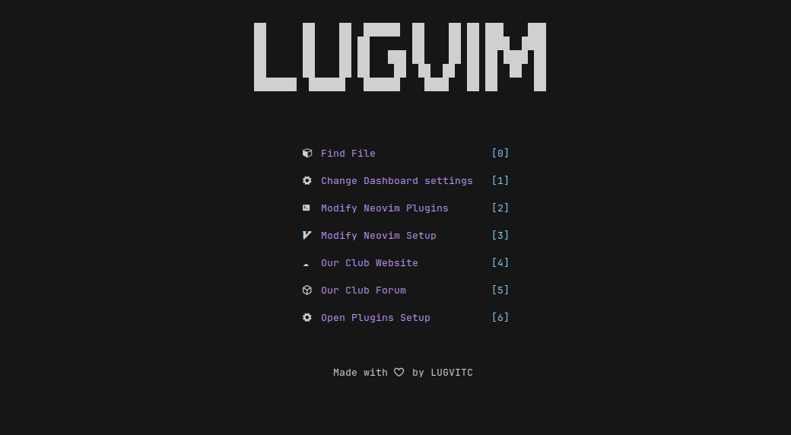

<p align='center'>
    
</p>

# LUGVIM

## Screenshots

### Dashboard


## About

- This repo contains LUGVIM, the nvim config for LUGOS.

- Meant for use in [LUGOS](https://github.com/lugvitc/LUG_custom_distro) (A Bedrock-derived distro made by the Linux Club OS Team)

- For further info on how to contribute to this project,refer to [CONTRIBUTING.md](CONTRIBUTING.md)


## Features

- Default theme - [oxocarbon.nvim](https://github.com/nyoom-engineering/oxocarbon.nvim)

- Lazy loaded using [lazy.nvim](https://github.com/folke/lazy.nvim)

- Git management via [lazygit.nvim](https://github.com/kdheepak/lazygit.nvim)

- Dashboard made using [dashboard.nvim](https://github.com/nvimdev/dashboard-nvim)

- Terminal support in nvim using [toggleterm.nvim](https://github.com/akinsho/toggleterm.nvim)

- Customized cmdline using [noice.nvim](https://github.com/folke/noice.nvim) 

- LSP support

- And much more !

## Installation

- ### Download neovim(version 0.7 or above) and npm

*For Ubuntu (Version 22.10 or above)*

```bash
sudo apt install npm neovim
```
*For Ubuntu (below version 22.10) and Debian*

```bash
sudo add-apt-repository ppa:neovim-ppa/unstable -y
sudo apt update
sudo apt install npm neovim 
```

- ### Download lazygit

```bash
LAZYGIT_VERSION=$(curl -s "https://api.github.com/repos/jesseduffield/lazygit/releases/latest" | grep -Po '"tag_name": "v\K[^"]*')
curl -Lo lazygit.tar.gz "https://github.com/jesseduffield/lazygit/releases/latest/download/lazygit_${LAZYGIT_VERSION}_Linux_x86_64.tar.gz"
tar xf lazygit.tar.gz lazygit
sudo install lazygit /usr/local/bin
```

- ### Clone this git repository to the .config folder

```bash
git clone https://github.com/lugvitc/LUGOS-nvim-config.git ~/.config/nvim
```
- ### Start neovim

```bash
nvim
```

- ### Enjoy !
