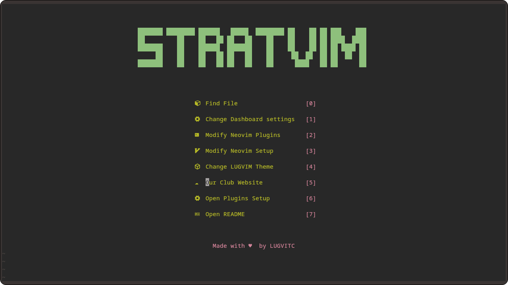

<p align='center'>
<!-- Put the new logo of StratOS here -->
</p>

# StratVIM

## Screenshots

### Dashboard


## About

- This repo contains STRATVIM, the nvim config for StratOS.

- Meant for use in [StratOS](https://github.com/StratOS-Linux/LUG_custom_distro)

- For further info on how to contribute to this project,refer to [CONTRIBUTING.md](CONTRIBUTING.md)


## Features

- Theme switching using [telescope-themes](https://github.com/andrew-george/telescope-themes)

- Lazy loaded using [lazy.nvim](https://github.com/folke/lazy.nvim)

- Git management via [lazygit.nvim](https://github.com/kdheepak/lazygit.nvim)

- Dashboard made using [dashboard.nvim](https://github.com/nvimdev/dashboard-nvim)

- Terminal support in nvim using [toggleterm.nvim](https://github.com/akinsho/toggleterm.nvim)

- Customized cmdline using [noice.nvim](https://github.com/folke/noice.nvim) 

- LSP support

- And much more !

## Installation

- ### Download neovim(version 0.7 or above) and npm
*For Ubuntu (Version 22.10 or above)*

```bash
sudo apt install npm neovim xclip
```
*For Ubuntu (below version 22.10) and Debian*

```bash
sudo add-apt-repository ppa:neovim-ppa/unstable -y
sudo apt update
sudo apt install npm neovim xclip
```
*For Fedora*
```bash
sudo dnf install npm neovim xclip
```

*For Arch*
```bash
sudo pacman -S npm neovim xclip lazygit
```
- ### Download lazygit (Fedora and Ubuntu)

```bash
LAZYGIT_VERSION=$(curl -s "https://api.github.com/repos/jesseduffield/lazygit/releases/latest" | grep -Po '"tag_name": "v\K[^"]*')
curl -Lo lazygit.tar.gz "https://github.com/jesseduffield/lazygit/releases/latest/download/lazygit_${LAZYGIT_VERSION}_Linux_x86_64.tar.gz"
tar xf lazygit.tar.gz lazygit
sudo install lazygit /usr/local/bin
```

- ### Clone this git repository to the .config folder

```bash
git clone https://github.com/StratOS-Linux/StratVIM.git ~/.config/nvim
```
- ### Start neovim

```bash
nvim
```

- ### Install pywal (optional, for using [pywal16.nvim](https://github.com/uZer/pywal16.nvim))

    - **Via pip :** 
    ```bash
        pip install pywal
   ```
   - **For Arch Linux :**
   ```bash
       sudo pacman -S python-pywal
   ```

- ### Enjoy !
